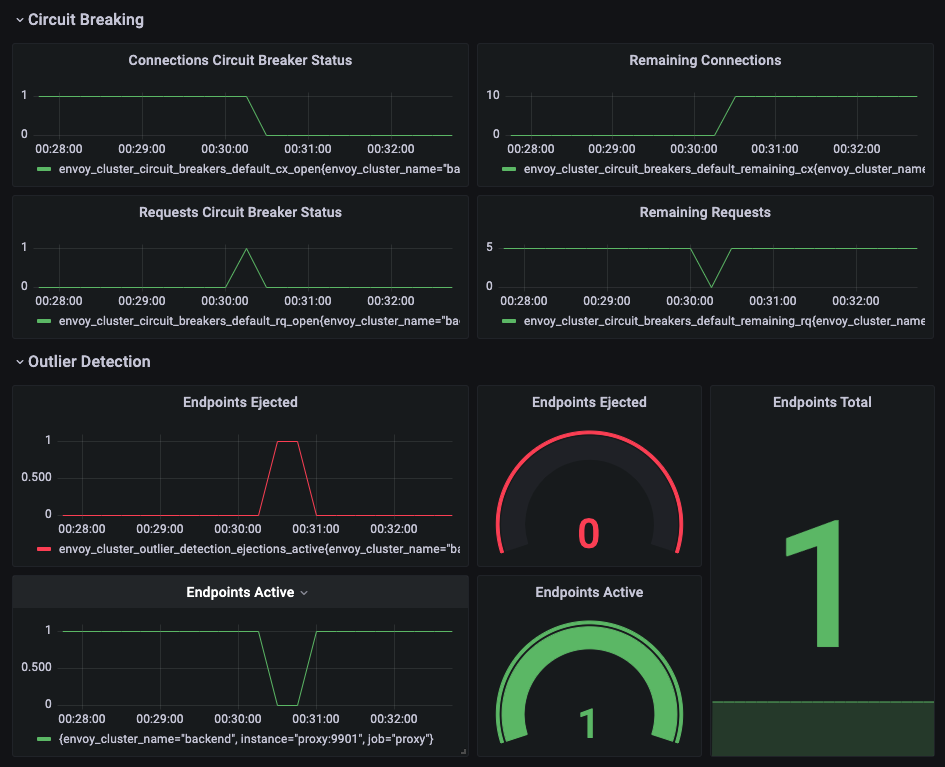

# Envoy Circuit Breaking Dashboard

Monitor requests, connections and outlier detections status from Envoy clusters.

Work in progress.

## Dashboard



## Test

```bash
minikube start --memory=4g --cpus=4

kubectl create ns envoy-dashboard

kubectl apply -f backend.yaml -n envoy-dashboard  
kubectl apply -f proxy.yaml -n envoy-dashboard
kubectl apply -f monitor.yaml -n envoy-dashboard

kubectl port-forward -n envoy-dashboard deploy/proxy 9901:9901
kubectl port-forward -n envoy-dashboard deploy/proxy 10000:10000
kubectl port-forward -n envoy-dashboard deploy/prometheus 9090:9090
kubectl port-forward -n envoy-dashboard deploy/grafana 3000:3000

curl -v http://localhost:10000/status/200
```